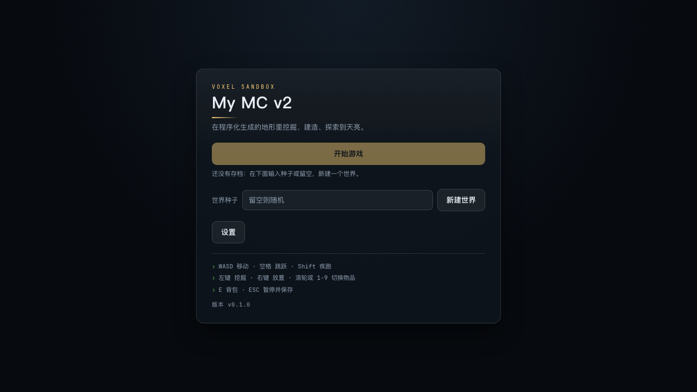
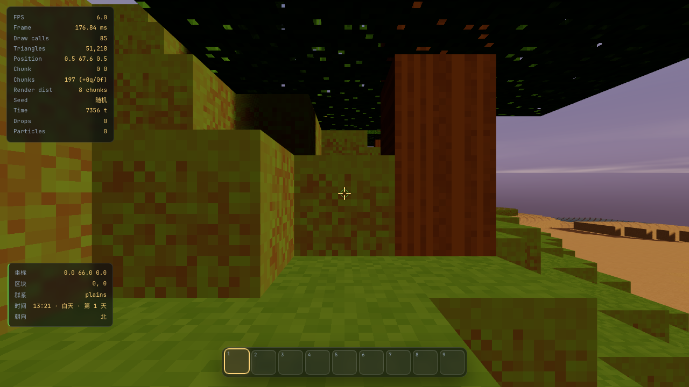
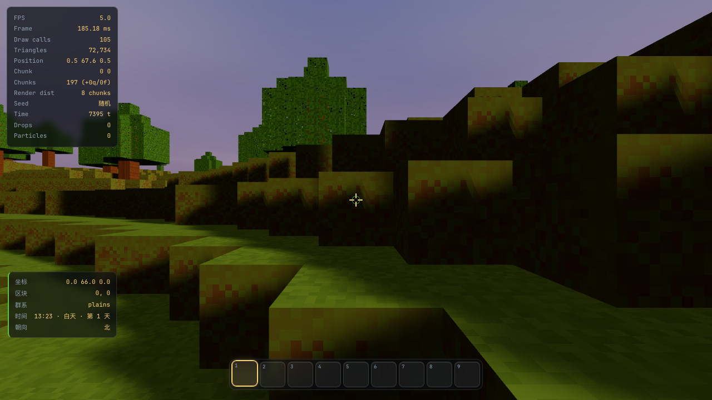
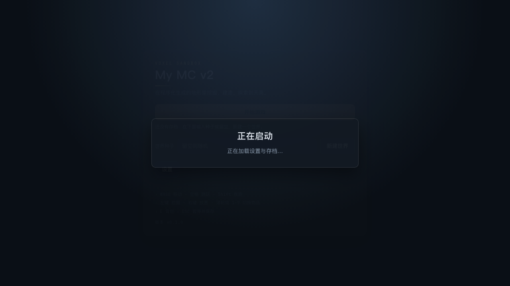

# My MC v2 — Three.js 体素沙盒游戏

> 一款使用 **Three.js + TypeScript** 从零实现的类 Minecraft 3D 体素沙盒游戏。
> 工程化优先：类型严格、测试分层、CI 质量门禁、可重复部署到 Cloudflare Pages。

[](https://github.com/demo-zexuan/my-mc-v2/actions/workflows/ci.yml)
[](https://my-mc-v2.pages.dev)
[](./LICENSE)

[](https://my-mc-v2.pages.dev)

## 游戏画面

|                     主菜单                     |                程序化体素世界                |
| :--------------------------------------------: | :------------------------------------------: |
|  |  |
|         **HUD / Hotbar / F3 调试面板**         |               **首屏加载骨架**               |
|           |    |

> 四张图都由 Playwright 浏览器套件在 1280×720 的真实 Chromium 中截取（无头软件渲染
> SwiftShader；`pnpm run test:e2e` 会先构建再跑同一套件），运行时写到
> `test-results/visual/`，再复制到 `docs/screenshots/`。
> **软件渲染的帧率不代表真机性能**，截图里的 `FPS` 行请只当作"渲染循环在推进"的证据。

---

## 1. 项目简介

My MC v2 是一个**方块构成的三维开放世界沙盒**：玩家以第一人称在程序化生成的地形中探索、
挖掘、放置方块、管理背包并建造。

与"渲染一堆 Cube Mesh"的玩具实现不同，本项目按**体素引擎**的真实做法构建：

- 世界由 **Chunk** 分块管理，方块数据存放在扁平 `TypedArray` 中，而不是对象列表；
- 区块网格通过 **面剔除 + 贪心合并** 生成，一个区块合并为极少数 Draw Call；
- 地形由**带种子的多层噪声**确定性生成，相同种子必然得到相同世界；
- 物理使用**固定时间步**推进，帧率波动不会让玩家穿墙；
- 重计算（地形生成）运行在 **Web Worker** 池中，不阻塞主线程。

### Overview (English)

A Minecraft-like 3D voxel sandbox built from scratch with Three.js and TypeScript, structured as
a real voxel engine: typed-array chunk storage (16 × 128 × 16 blocks per chunk), greedy-meshed
chunk geometry with a custom atlas-UV shader patch, seeded multi-octave terrain generation with
biomes, caves, ore veins and deterministic trees, fixed-timestep player physics with AABB voxel
collision and DDA ray casting, worker-pooled chunk generation with a synchronous fallback, a
programmatic block atlas and procedurally synthesised sound effects (no binary art or audio
assets), a day/night cycle, item drops and pooled particles, an inventory/hotbar implemented in
plain DOM, persistence through a versioned IndexedDB save format with schema migration, and a CI
pipeline that gates type safety, linting, unit/integration tests, browser E2E tests, pixel-level
visual checks and the production build.

---

## 2. 技术栈

| 领域           | 选型                                                                    | 版本             | 选择理由                                                                  |
| -------------- | ----------------------------------------------------------------------- | ---------------- | ------------------------------------------------------------------------- |
| 3D 渲染        | [Three.js](https://threejs.org/)                                        | 0.186.1          | 需求指定；WebGL2 渲染器、成熟的 BufferGeometry 与材质体系                 |
| 语言           | [TypeScript](https://www.typescriptlang.org/)                           | 5.9.3            | 需求指定；开启全部严格检查（见 [tsconfig.json](./tsconfig.json)）         |
| 构建           | [Vite](https://vite.dev/)                                               | 8.3.1            | 原生 ESM、模块 Worker、`import.meta.env` 静态替换、极快的 HMR             |
| 包管理         | [pnpm](https://pnpm.io/)                                                | 12.6.0           | 严格依赖布局，避免幽灵依赖；锁文件在 CI 中冻结                            |
| 单元/集成测试  | [Vitest](https://vitest.dev/)                                           | 5.0.2            | 与 Vite 共用转换管线，零额外配置；原生支持 jsdom 与 v8 覆盖率             |
| E2E / 视觉测试 | [Playwright](https://playwright.dev/)                                   | 1.63.0           | 真实 Chromium 中运行生产构建；`page.screenshot()` 配合 pngjs 做像素级断言 |
| 代码检查       | [ESLint](https://eslint.org/) + typescript-eslint                       | 10.11.0 / 8.70.1 | 开启类型感知规则（`no-floating-promises`、`no-explicit-any` 等）          |
| 格式化         | [Prettier](https://prettier.io/)                                        | 3.9.9            | 格式化交给 Prettier，ESLint 不参与风格争论                                |
| 运行时校验     | [Zod](https://zod.dev/)                                                 | 4.6.5            | 环境变量与存档数据在启动/读取时校验，损坏数据不会静默传播                 |
| 部署           | [Cloudflare Pages](https://developers.cloudflare.com/pages/) + Wrangler | 4.140.0          | 全球边缘静态托管，零运维，GitHub 集成或直接上传均支持                     |
| 运行时         | Node.js                                                                 | ≥ 22.12（CI 24） | `engines.node`；CI 使用 Node 24                                           |

> **关于 TypeScript 版本**：`typescript-eslint@8.70` 的 peer 约束是 `>=4.8.4 <6.1.0`
> （实测自 `node_modules/typescript-eslint/package.json`）。为保证"类型检查 + 类型感知
> lint"整条链路自洽，项目固定使用 5.9.3，而不是盲目跟随 `latest`。

**刻意没有引入的依赖**：`React/Vue/Svelte`（UI 用原生 DOM + CSS，避免框架与 60Hz 游戏
循环耦合）、`stats.js`/`lil-gui`（自建面板才能显示区块数、渲染距离等引擎指标）、
`simplex-noise`（自研噪声可保证**跨版本确定性**，否则升级依赖会改变已保存世界的地形）。
音频与纹理同样是程序化生成的，仓库里没有任何二进制美术 / 音频资源。

---

## 3. 已实现功能

以下清单中的每一项都能在 `src/` 里找到对应实现；版本号读自 `package.json`。

### 世界

- **16 × 128 × 16 的区块**，方块存扁平 `Uint8Array`（32768 字节/区块），坐标换算集中在
  `src/world/coords.ts`，负坐标同样正确。
- **22 种方块**（`air` … `brick`），每种带属性位（固体 / 不透明 / 透明 / 液体 / 可破坏 /
  自发光）、破坏硬度、掉落物与透光衰减；方块 id 与定义数组下标强绑定，**不得重编号**。
- **区块流式加载 / 卸载**（`ChunkStreamer`），按渲染距离排队、限制并发、跨区块才重算队列，
  并额外保留一圈缓冲避免边界反复卸载。
- **只有被修改过的区块才写盘**（`Chunk.getEdits()`），未修改区块靠种子重新生成。

### 地形

- **自研确定性噪声**（`src/terrain/Noise.ts`）：种子化 PRNG + 梯度噪声 + FBM + ridged +
  域扭曲；同一 `(seed, cx, cz)` 必然产出同一区块。
- **7 种生物群系**：`ocean` / `beach` / `plains` / `forest` / `hills` / `mountains` / `snow`，
  按高度、温度、湿度分类，各自有地表材质与成树密度。
- **海平面 62** 的水体与沙滩、雪线、寒冷区域水面结冰、深海海底铺砾石。
- **洞穴**：两路 3D 噪声的平方和阈值掏空，地表以下 4 格不挖（避免地表朝天大洞）。
- **矿脉**：煤（≤ Y112）/ 铁（≤ Y64）/ 金（≤ Y32）/ 钻石（≤ Y16）按深度加权抽取，
  使用确定性特征网格，跨区块不重复、不截断。
- **树木**：按群系取密度与树干高度，特征网格保证边界处不重复生成。
- **超平坦生成器**（`FlatTerrainGenerator`）供单元测试与性能基准使用。

### 渲染

- **程序化方块图集**：16×16 的 tile + 4px 边缘复制 padding 画进 canvas，放大用
  `THREE.NearestFilter`、色彩空间设为 sRGB、各向异性默认 4；仓库里没有任何贴图文件。
- **面剔除 + 贪心合并**（`ChunkMesher`）：输出不透明 / 透明两组 typed array
  （positions / normals / uvs / tileRects / indices），一个区块只有极少数 Draw Call。
- **自定义着色器补丁**：合并后的四边形横跨 N 个方块，UV 在片元里用 `fract()` 折回图集内
  边界，并用 `textureGrad()` 修正 mip 级别（否则方块边界会出现"邻居颜色"亮线）。
- **视锥剔除 + 每帧重建预算**（默认 2 个区块/帧）+ **邻居齐备门控**（4 个水平邻居都加载
  完才建网格，否则边界会出现假墙）。
- **昼夜天空**：渐变天空 + 太阳 + 月亮 + 云层 + 雾色随时间插值，相位
  `dawn / day / dusk / night`，一天默认 20 分钟。
- **光照**：半球环境光 + 单个投影平行光（太阳 / 月亮），画质预设控制阴影贴图尺寸与
  `devicePixelRatio` 上限。

### 玩家

- **第一人称相机**：yaw/pitch（俯仰限制 ±89°）、FOV（50–110）、鼠标灵敏度、Y 轴反转、
  可关闭的视角摇晃与疾跑 FOV 变化。
- **移动**：`WASD` / 方向键、`Shift` 疾跑、`Ctrl` 潜行、`Space` 跳跃；固定 1/60 秒步长推进。
- **手感参数**：步行 4.317、疾跑 5.612、潜行 1.3 格/秒，重力 32，起跳 8.8，坠落终速 78.4，
  土狼时间 0.1 秒，跳跃缓冲 0.15 秒，地面与空中加速度不同。
- **AABB 逐轴碰撞求解**：分段推进防穿墙、卡进方块时沿最小穿透轴自救、`onGround` 判定。
- **DDA 体素射线**（Amanatides & Woo）：5 格触及距离，返回命中方块与命中面法线。

### 交互

- **持续挖掘**：按住左键按方块硬度累计进度，中途看向别处立即重置，不可破坏的基岩无进度。
- **放置方块**：依据命中面法线计算目标位置，7 种拒绝条件（无目标 / 超出距离 / 手上没物品 /
  方块不可放置 / 目标被占据 / 会与玩家包围盒相交 / 世界拒绝写入）。
- **准星**在瞄准可交互方块时切换形态。
- **掉落物**：重力 + 地面吸附 + 旋转 + 延迟自动拾取 + 同类合并 + 生命周期上限。
- **池化粒子**：破坏 / 放置粒子用固定容量 512 的 SoA 池，永不增长。

### UI

- 原生 DOM + CSS（无框架），暗色主题统一由 `src/styles/main.css` 的 CSS 变量驱动。
- **主菜单**（开始游戏 / 新建世界可输入种子 / 设置）、**暂停菜单**（继续 / 设置 / 保存并退出）。
- **设置界面**：灵敏度、FOV、渲染距离、主/音效/环境音量、画质预设、阴影、调试面板、
  视角摇晃、Y 轴反转；改动即时生效并可恢复默认。
- **背包**：27 格背包 + 9 格快捷栏，点击拾取/放下、`Shift` 点击快速移动、悬停提示。
- **Hotbar**：9 格、居中底部、数字键与滚轮切换、显示方块图标与数量。
- **HUD**：坐标 / 区块 / 群系 / 时间 / 朝向 / 帧率；**提示栈**：右上角自动消失的通知。
- **启动屏**：`index.html` 里的静态首屏骨架（脚本还没加载时也不白屏），运行时接管为加载
  进度与 fatal 错误卡；`F3` 调试面板显示 12 行引擎指标。

### 环境

- **昼夜循环**：24000 刻一天（0 刻为日出），可暂停；驱动天空、雾色与光照强度。
- **程序化音效**：21 个音效（8 种材质 × 破坏/脚步 + 放置 / 跳跃 / 落地 / UI 点击 / 拾取），
  用 oscillator + 噪声 buffer + 包络合成；`AudioContext` 在首次用户手势后解锁，
  失败时降级为静音而不中断游戏；按距离衰减。
- 水 / 冰 / 雪、雾与天空颜色联动。

### 存档

- **IndexedDB**（库名 `my-mc-v2`，object store：`worlds` + `chunks`），不使用 localStorage
  存区块数据。
- **版本化结构**：`SAVE_SCHEMA_VERSION = 2`，带 v1 → v2 迁移链；损坏数据抛
  `SAVE_CORRUPTED`，版本高于程序支持抛 `SAVE_VERSION_UNSUPPORTED`。
- **自动保存节流**：20 秒一次，或累计 64 次方块修改触发。
- **设置持久化**到 localStorage（键 `my-mc-v2:settings`），读取时对每个字段独立钳制。
- 存储不可用时**降级**：只禁用"继续游戏"，玩家仍可新建世界。

---

## 4. 安装

**前置要求**：Node.js ≥ 22.12（推荐 24 LTS）、pnpm ≥ 10、支持 WebGL 2 的浏览器。

```bash
# 1. 克隆仓库
git clone git@github.com:demo-zexuan/my-mc-v2.git
cd my-mc-v2

# 2. 安装依赖（pnpm 会自动读取 packageManager 字段）
corepack enable          # 可选：让 corepack 管理 pnpm 版本
pnpm install

# 3. 准备本地环境变量
cp .env.example .env     # 全部变量都有默认值，可以直接跳过这一步

# 4. 首次运行 E2E 前下载浏览器
pnpm exec playwright install chromium
```

> **pnpm 构建脚本白名单**：pnpm ≥ 10 默认阻止依赖的安装脚本。`pnpm-workspace.yaml`
> 中显式放行了 `esbuild`（平台二进制）与 `workerd`（Wrangler 运行时），其余依赖保持
> 被阻止状态，避免供应链风险。同一文件里的 `minimumReleaseAgeExclude` 为本项目固定的
> Vitest 5.0.2 及其三个子包开了隔离期豁免——原因与调试方法见
> [`docs/DEVELOPMENT.md`](./docs/DEVELOPMENT.md)。

---

## 5. 运行

```bash
pnpm run dev
```

打开 <http://127.0.0.1:5173>。开发服务器具备 HMR；修改 `src/` 下任意文件即时生效。

预览**生产构建**（与 Cloudflare Pages 上完全一致的产物）：

```bash
pnpm run build
pnpm run preview        # http://127.0.0.1:4173（--strictPort）
```

---

## 6. 测试

测试分三层，全部可在本地与 CI 中重复执行。

```bash
pnpm run test           # 单元测试 + 集成测试（Vitest）：68 个文件 / 895 个用例
pnpm run test:watch     # 监听模式
pnpm run test:coverage  # 生成覆盖率报告到 coverage/

pnpm run test:e2e       # 构建 + 真实浏览器 E2E / 视觉测试（Playwright）
pnpm run test:e2e:run   # 仅跑浏览器测试，复用已有 dist/
```

### 测试分层

| 层级     | 位置                              | 覆盖内容                                                                                                |
| -------- | --------------------------------- | ------------------------------------------------------------------------------------------------------- |
| 单元测试 | `tests/unit/**`                   | 噪声与地形确定性、区块索引与负坐标、贪心合并不变量、碰撞与射线、背包规则、存档迁移、UI 组件（jsdom）    |
| 集成测试 | `tests/integration/**`            | 模块协作：场景装配、区块流式渲染、天空与环境联动、世界生成流水线                                        |
| 架构测试 | `tests/unit/architecture.test.ts` | 依赖方向、无循环依赖、分层白名单、生产代码不引用测试代码                                                |
| E2E 测试 | `tests/e2e/**`                    | 真实 Chromium 加载**生产构建**：引擎启动、WebGL2 上下文、F3 面板、WASD 移动、跳跃、背包、暂停、进出世界 |
| 视觉测试 | `tests/e2e/visual.spec.ts`        | 解码截图后做**像素断言**：非纯色、天空与地面可区分、准星与 Hotbar 居中、脚本延迟加载时首屏不空白        |

### 浏览器套件规模

| Suite                    | 用例数 | 内容                                                                                                                                      |
| ------------------------ | ------ | ----------------------------------------------------------------------------------------------------------------------------------------- |
| `boot.spec.ts`           | 10     | `engine boot` 4 个（启动 / 无严重诊断 / F3 / resize）+ `gameplay` 6 个（地形与区块、WASD 移动、跳跃、背包、暂停、返回菜单再进第二个世界） |
| `visual.spec.ts`         | 4      | 主菜单可读、世界非黑屏且受光、准星与 Hotbar 居中、加载骨架可见                                                                            |
| **主套件合计**           | **14** | `boot` / `gameplay` / `visual` 三个 suite                                                                                                 |
| `qa-visual.spec.ts`      | 5      | QA 的视觉验收：HUD 居中、几何规模合理、暂停时无闪烁、改变视口不溢出、天空保持蓝调                                                         |
| `qa-integration.spec.ts` | 变化中 | QA 的集成层验收：连续进出世界的资源增长、`Esc`/`E`/`F3` 与「暂停 → 设置 → 返回」的组合状态、保存后恢复                                    |

> QA 的两个 suite 由 QA 轨道单独维护、用例数持续变化，因此不在此处给固定数字；上表中主套件
> 的 14 个用例是撰写本文档时逐文件清点的结果。

视觉测试的关键点：它不只是"截图存档"，而是**解码 PNG 后断言像素分布**（`tests/e2e/support/image.ts`）。
这能捕获 DOM 断言完全看不到的问题——黑屏、相机朝向虚空、着色器编译成功但输出纯色。

### 质量门禁

```bash
pnpm run check        # typecheck → lint → format:check → test → build
pnpm run check:full   # check + 浏览器 E2E
```

`check` 是提交前的唯一入口，也是 CI `quality` job 的内容；CI 的 `e2e` job 复用 `quality`
产物（下载 artifact）而不是重新构建，因此绿灯的 E2E 认证的就是将要发布的同一份字节。
**任一环节失败都不应继续开发。**

---

## 7. 构建

```bash
pnpm run build
```

产物输出到 `dist/`（文件名带内容 hash）：

```
dist/
├── index.html                    # 含静态首屏骨架，JS 未加载时也不会白屏
├── assets/index-<hash>.js        # 应用代码
├── assets/three-<hash>.js        # Three.js（独立 chunk，跨部署稳定缓存）
├── assets/terrainWorker-<hash>.js# 地形生成 worker
├── assets/index-<hash>.css
├── favicon.svg
├── _headers                      # Cloudflare Pages 响应头（缓存 + 安全）
└── _redirects                    # SPA 回退规则
```

构建前会先执行完整 `typecheck`——**类型错误不可能进入产物**。

---

## 8. 部署

目标平台为 **Cloudflare Pages**（纯静态 SPA，无 Functions）。

### 方式一：直接上传（推荐，`pnpm run deploy`）

```bash
export CLOUDFLARE_API_TOKEN=...     # 权限：Cloudflare Pages: Edit
export CLOUDFLARE_ACCOUNT_ID=...
pnpm run deploy                     # = build + wrangler pages deploy dist
```

首次部署会自动创建 Pages 项目 `my-mc-v2`。

### 方式二：GitHub Actions 自动部署

`.github/workflows/deploy-cloudflare-pages.yml` 会在推送到 `main` 时构建并部署。
需要在仓库 **Settings → Secrets and variables → Actions** 中配置：

| Secret                  | 说明                                                |
| ----------------------- | --------------------------------------------------- |
| `CLOUDFLARE_API_TOKEN`  | Cloudflare API Token，权限 `Cloudflare Pages: Edit` |
| `CLOUDFLARE_ACCOUNT_ID` | Cloudflare 账户 ID                                  |

未配置 Secret 时：**生产构建仍然会执行并作为 artifact 上传**，只有上传步骤被跳过，同时
在工作流中输出一条明确的提示。这样 `main` 分支不会因为一个可选的部署配置而常态飘红，
也不会出现"静默部署了空内容"的情况。

### 方式三：Cloudflare Pages Git 集成

在 Cloudflare Dashboard 连接本仓库，配置：

- Build command：`pnpm run build`
- Build output directory：`dist`

### 部署配置

- [`wrangler.toml`](./wrangler.toml)：项目名与 `pages_build_output_dir`
- [`public/_headers`](./public/_headers)：`assets/*` 一年不可变缓存（文件名带 hash），
  `index.html` 强制回源，避免旧 HTML 指向已删除的 hash 资源
- [`public/_redirects`](./public/_redirects)：SPA 回退，深链不会 404

---

## 9. 项目架构

```
src/
├── main.ts                 # 浏览器入口：挂载 + 全局错误兜底
├── app/                    # 应用装配与生命周期：GameApp / WorldSession / GameState
├── config/                 # 环境变量校验（Zod）
├── engine/core/            # 与渲染无关的引擎内核：固定步长游戏循环、帧统计
├── engine/events/          # 事件总线与冻结的事件表
├── rendering/              # 渲染层：渲染器工厂、光照环境、天空、区块网格、世界渲染器
├── rendering/textures/     # 程序化方块图集与纹理
├── world/                  # 体素世界：方块注册表、区块、世界、流式加载、坐标系统
├── terrain/                # 程序化地形：噪声、生物群系、洞穴、矿脉、树木
├── player/                 # 玩家：控制器、相机、状态
├── physics/                # 物理：Vec3、AABB 体素碰撞、DDA 射线检测
├── input/                  # 输入：键鼠绑定、指针锁定
├── inventory/              # 物品与背包：ItemStack、堆叠规则、物品注册表
├── interaction/            # 交互：选中、挖掘、放置
├── entities/               # 实体：掉落物与掉落物渲染
├── particles/              # 粒子系统（固定容量对象池）
├── ui/                     # DOM UI：启动屏、主菜单、HUD、Hotbar、背包、设置、提示栈
├── debug/                  # 调试面板（F3）
├── audio/                  # 音频：AudioContext 延迟初始化 + 程序化音效合成
├── save/                   # 存档：IndexedDB + 版本迁移 + 自动保存节流
├── workers/                # Web Worker：地形生成线程池与消息协议
├── settings/               # 设置项定义、校验与持久化
├── styles/                 # 全局 CSS（暗色主题变量）
└── utils/                  # 无状态工具：日志、错误模型、异步辅助
```

### 架构约束

1. **单向依赖**：`ui`/`debug` 可以依赖下层，下层**不得**反向依赖 UI 或 `app`。
2. **无循环依赖**：通过 `tests/unit/architecture.test.ts` 静态扫描 import 图强制执行
   （`import type` 不算依赖边，因为 `verbatimModuleSyntax` 保证它被完全擦除）。
3. **入口不持有游戏规则**：`GameApp` 只负责创建与销毁资源，玩法规则属于各自系统。
4. **资源成对管理**：任何 `create*` 都返回配套的 `dispose()`，这是体素游戏不泄漏 GPU
   内存的前提。

模块契约（真实方法签名 + 为什么这样设计）见 [`docs/ARCHITECTURE.md`](./docs/ARCHITECTURE.md)；
本地开发、调试与常见问题见 [`docs/DEVELOPMENT.md`](./docs/DEVELOPMENT.md)。

---

## 10. 操作方式

键位定义在 [`src/input/InputManager.ts`](./src/input/InputManager.ts) 的 `DEFAULT_BINDINGS`，
下表与之逐项对应（`F3` 与 `E` / `Esc` 由 `GameApp` 的状态相关快捷键处理）：

| 按键                 | 功能                             |
| -------------------- | -------------------------------- |
| `W` `A` `S` `D`      | 前后左右移动（方向键同样有效）   |
| `Shift`              | 疾跑（需向前移动，潜行时不生效） |
| `Ctrl`               | 潜行（降低移动速度）             |
| `Space`              | 跳跃                             |
| 鼠标移动             | 转动视角（进入世界后锁定指针）   |
| 鼠标左键（`Mouse0`） | 按住持续挖掘方块                 |
| 鼠标右键（`Mouse2`） | 放置方块                         |
| `1` – `9`            | 选择快捷栏槽位                   |
| 鼠标滚轮             | 切换快捷栏槽位                   |
| `E`                  | 打开 / 关闭背包                  |
| `Esc`                | 暂停 / 释放指针                  |
| `F3`                 | 显示 / 隐藏调试面板              |

> `DEFAULT_BINDINGS` 里还定义了 `Mouse1`（`pick`）与 `Q`（`drop`）两个动作，但当前 `src/`
> 里**没有消费方**：按下它们不会有任何效果（`pick` 在 Minecraft 里是取色/拾取方块，`drop`
> 是丢弃物品，这里只是预留绑定）。

---

## 11. 后续路线图

| 阶段     | 内容                                                                | 状态      |
| -------- | ------------------------------------------------------------------- | --------- |
| Phase 0  | 工程闭环：TS/Vite/ESLint/Vitest/Playwright/CI/Cloudflare 配置       | ✅ 已完成 |
| Phase 1  | Three.js 基础引擎：Scene/Camera/Renderer/Light/GameLoop/Input/Debug | ✅ 已完成 |
| Phase 2  | 体素引擎：Block 注册表、Chunk、World、面剔除 + 贪心网格             | ✅ 已完成 |
| Phase 3  | 程序化地形：种子、多层噪声、生物群系、树木、水体、洞穴、矿脉        | ✅ 已完成 |
| Phase 4  | 玩家：第一人称相机、重力、跳跃、AABB 碰撞、射线检测                 | ✅ 已完成 |
| Phase 5  | 沙盒交互：目标选中（准星变形态）、破坏、放置、掉落物、拾取          | ✅ 已完成 |
| Phase 6  | 物品与背包：ItemStack、9 格快捷栏、27 格背包、点击搬运              | ✅ 已完成 |
| Phase 7  | 环境：昼夜循环、天空/日月/云、雾、水体、粒子、音频                  | ✅ 已完成 |
| Phase 8  | 存档：世界种子、玩家状态、背包、已修改区块、设置                    | ✅ 已完成 |
| Phase 9  | 性能：按实测 Profile 优化区块网格、Draw Call、内存与 GC             | ⏳ 进行中 |
| Phase 10 | QA：功能/UI/性能/浏览器兼容/长时间运行                              | ⏳ 进行中 |
| Phase 11 | 发布：GitHub 仓库、生产构建、Cloudflare Pages 验收                  | ⏳ 进行中 |

**Phase 9 已有的手段**：贪心合并、每帧重建预算、视锥剔除、worker 池、对象池化的粒子与
掉落物。**还缺**：真实 GPU 上的 profile 数据、区块 LOD、以及大规模爆炸式修改后的内存基线。

**Phase 10 已有的手段**：`boot`/`gameplay`/`visual` 主套件 14 个用例（含视觉像素断言）+ QA
轨道额外的视觉与集成验收套件、对抗式单元测试与性能脚本。
**还缺**：长时间运行的稳定性测试与多浏览器矩阵（目前只有 Chromium）。

### 对标 Minecraft 的扩展方向（核心稳定后再做）

结构与村庄、生物与简单 AI、生命值/食物/合成、工具与装备、熔炉与工作台、箱子与门、
火把与光照传播、天气（雨雪雷）、水流扩散、岩浆、多人联机（WebSocket + 服务器权威）。

判断标准始终是：**是否提升可玩性、是否符合体素沙盒方向、是否值得当前阶段做**。
不值得的功能进入路线图，而不是硬塞进代码。

---

## 开发规范

- **提交信息**：Emoji + [Conventional Commits](https://www.conventionalcommits.org/)，例如
  `✨ feat(world): add chunk greedy meshing`。首行 ≤ 72 字符。
- **注释**：解释 _为什么_，而不是重复代码在做什么；多层次说明使用 `I.` / `1.` / `(1)` 层级。
- **代码质量**：禁止 `any`、禁止非空断言、禁止超级类；组合优于继承。
- 详见 [`CONTRIBUTING.md`](./CONTRIBUTING.md)。

## 许可证

[MIT](./LICENSE)
